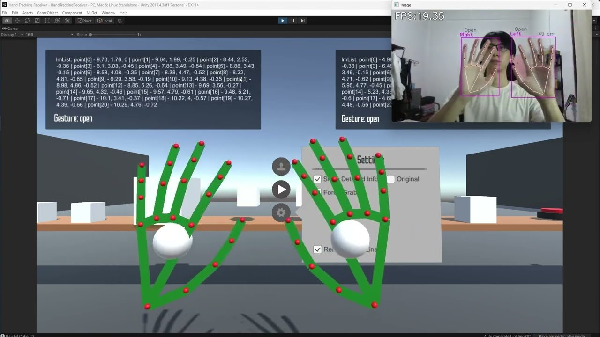
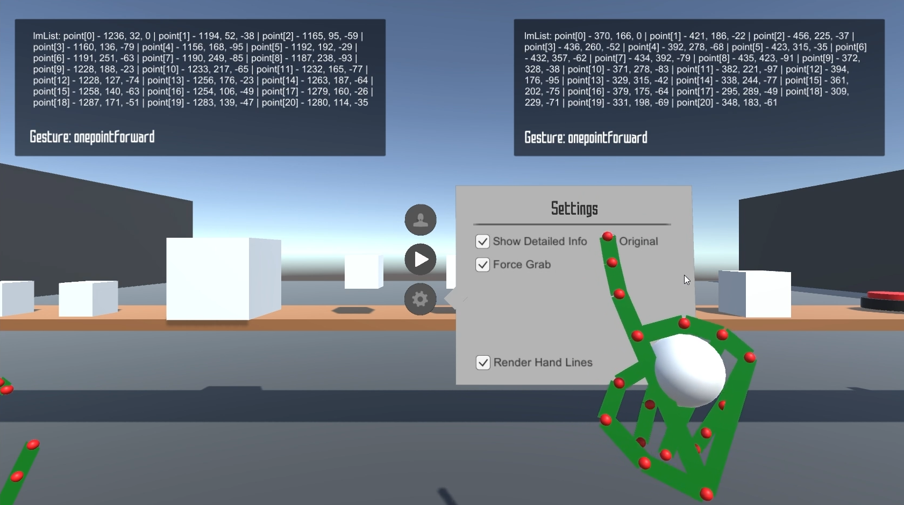

# Hand Tracking Receiver (Unity 2019)

### Watch [Demo Video](https://www.youtube.com/watch?v=ocB7OnGq14M)

This unity project requires [Hand-Tracking-Capture](https://github.com/haneure/Hand-Tracking-Capture) to run. Hand Tracking Capture will send a stream of JSON data to Unity, and Unity will parse the data and use the data to create the virtual hand.

The unity project contains a simple playground that has an interactor and interactable object, an interactor can trigger an event on any interactable object (Interactor and Interactables are the concepts that are used by XR Toolkit). The interactor is the hand, and interactable is the cubes, terminal, and the UI.

### Unity
[3D Hand Tracking in Virtual Environment](https://www.youtube.com/watch?v=RQ-2JWzNc6k)
